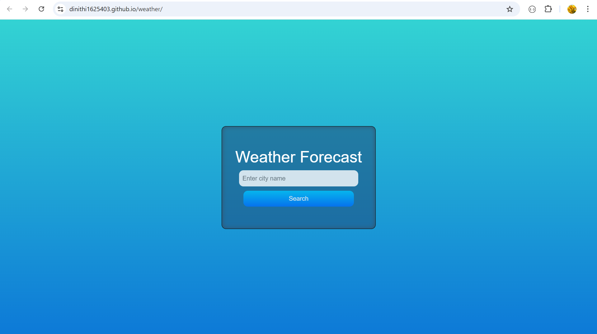

<h1 align="center" id="title">Weather Forecast</h1>

Our Weather Forecast App is designed to provide accurate and up-to-date weather information. Built using HTML CSS Bootstrap and JavaScript this app offers a user-friendly interface and reliable data to help you plan your day.

<h2>🚀 Demo</h2>

[videos/demo.mp4](videos/demo.mp4)

  
  
<h2>🧐 Features</h2>

Here're some of the project's best features:

*   Current Weather: Get real-time weather updates for your location
*   Hourly Forecast: Plan your day with detailed hourly weather forecasts
*   Responsive Design: Enjoy a seamless experience on any device thanks to Bootstrap's responsive framework.
*   User-Friendly Interface: Navigate easily through the intuitive and visually appealing design.

  
  
<h2>💻 Built with</h2>

Technologies used in the project:

*   HTML5: Used for structuring the content and layout of the app.
*   CSS3: Utilized for styling the app creating a visually appealing and responsive design.
*   Bootstrap: Employed to streamline the development of responsive and mobile-first web pages with its powerful grid system and pre-designed components.
*   JavaScript: Core functionality of the app is powered by JavaScript enabling dynamic content updates and interactive features.
*   OpenWeather API: Integrated to fetch real-time and accurate weather data ensuring users receive up-to-date information.
*   Git and GitHub: Version control and collaboration facilitated through Git and GitHub ensuring seamless management of code changes and contributions.

<h2>💖Like my work?</h2>

Thank you for using the Weather Forecast App! We hope it helps you stay informed and prepared for any weather conditions. If you encounter any issues or have any questions our support team is here to help. Email: For support please email us at dinithi1625403@gmail.com.
